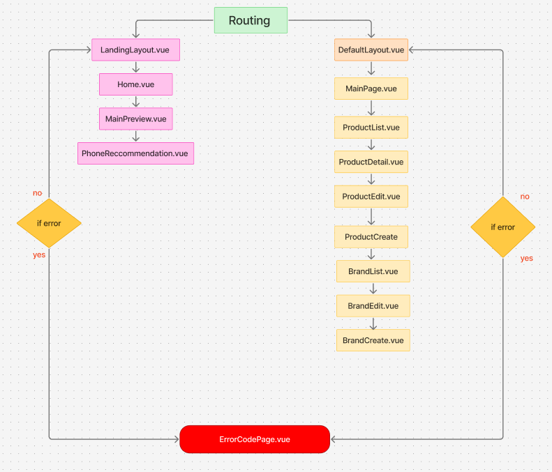
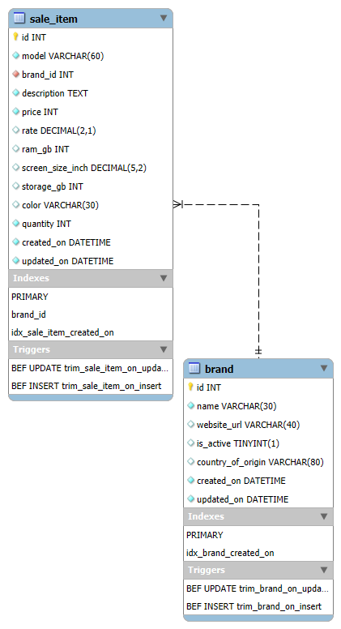
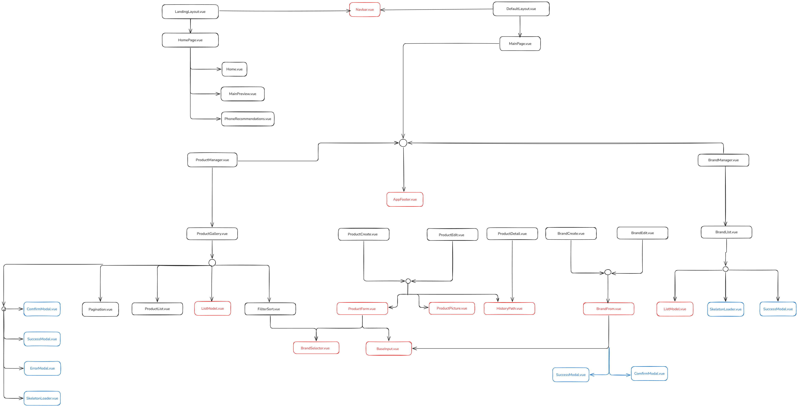

# 2-2567_INT221_KK-1
## Member
| ลำดับ | Student ID   | First Name | Last Name | Group |
|-------|--------------|------------|-----------|-------|
| 1     | 66130500004  | Kongphob   | Kongsan   | KK1   |
| 2     | 66130500027  | Napat      | Chumtham  | KK1   |
| 3     | 66130500062  | Pongsakorn | Sinsomboonsuk | KK1   |

# About Phonezy Web Application

## API Document
[INT221_KK1_API_DOCUMENTS_1.pdf](https://github.com/user-attachments/files/20492491/INT221_KK1_API_DOCUMENTS_1.pdf)

## System Architecture

## Routing

## Hierarchy

## ER-DIAGRAM

## Component relationship

